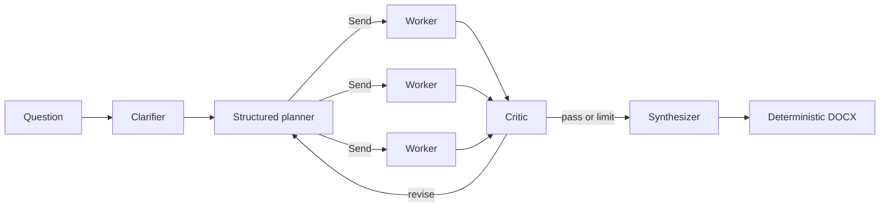

# AutoResearcher

AutoResearcher turns a question into a source-grounded Microsoft Word report. It routes
planning to a supported LLM, searches Tavily (or DuckDuckGo when no Tavily key is set),
and renders deterministic `.docx` output without asking an LLM to generate document bytes.

> This repository currently implements Phase 2: LangGraph parallel workers, deterministic
> clarification, an evidence critic loop, priority plain-Python tools, and cited DOCX output.
> MCP transport, persistent vector backends, richer templates, and the API arrive in later
> phases described in `todo.txt`.

## Install

For a released package:

```bash
python -m pip install autoresearcher-ai
```

For development from this checkout, including test and packaging tools:

```bash
python -m pip install -e ".[dev]"
```

Python 3.10 or newer is required.

AutoResearcher uses the LangChain 1.x / LangGraph 1.x dependency line. It can be installed in
an application that already uses `langchain>=1,<2` without downgrading that application's
LangChain packages.

## Documentation

- [Install and use the PyPI package](docs/USAGE.md)
- [Use AutoResearcher inside another Python system](docs/INTERNAL_USAGE.md)
- [TestPyPI and PyPI publishing checklist](docs/PUBLISHING.md)
- [Resume and interview preparation](docs/RESUME_AND_INTERVIEW.txt)

> The PyPI distribution is named `autoresearcher-ai`; the Python import remains
> `from autoresearcher import AutoResearcher`.

## Quickstart

Set at least one provider key in the environment or a local `.env` file:

```bash
export ANTHROPIC_API_KEY="..."
export TAVILY_API_KEY="..."  # optional; DuckDuckGo is the fallback
```

```python
from autoresearcher import AutoResearcher

researcher = AutoResearcher(
    models={"planner": "openai", "writer": "openai"},
    languages=["tamil", "hindi", "telugu", "malayalam"],
    include_images=True,
)
result = researcher.run("Chennai trip for 3 days", output="chennai_trip.docx")
print(result.docx_path)
```

For trip questions, AutoResearcher puts a source-backed current forecast and a separately
researched "best time to visit" section near the front of the report. Translated highlight
sections retain the citations from the English findings. Images are downloaded from Wikimedia
Commons, embedded locally, and listed in Sources with their license and creator attribution.
When images are enabled, a writer agent selects five specifically named places: one cover image
and four images in a two-column visual gallery. If no travel date is supplied, the report labels
the forecast as starting on the report-generation date and never treats it as an itinerary date.

Constructor keys take precedence over environment variables, which take precedence over
`.env`. The aliases `GEMINI_API_KEY` and `GOOGLE_API_KEY` are both supported. Keys use
Pydantic secret values and are excluded from representations and validation errors.

The command-line equivalent is:

```bash
autoresearcher "Chennai trip for 3 days" -o chennai_trip.docx \
  --languages tamil,hindi,telugu,malayalam --images
```

To run the paid live OpenAI smoke test included in the repository:

```bash
export OPENAI_API_KEY="..."
python examples/test_openai_live.py "Chennai trip for 3 days" \
  --max-subagents 8 -o chennai_trip.docx
```

The live example enables all four translated highlight sections and five licensed images by
default. Use `--languages ""` or `--no-images` to disable them. It also reads `OPENAI_API_KEY`
from a local `.env` file and never prints the key.

An application-style package example is also available:

```bash
python examples/use_as_package.py "Chennai trip for 3 days" -o chennai_trip.docx
```

## Model routing

Roles accept a provider alias or `provider:model-id`, for example:

```python
AutoResearcher(models={
    "planner": "claude:claude-sonnet-5",
    "worker": "gemini",
    "writer": "openai:gpt-5-mini",
})
```

Supported aliases are `claude`/`anthropic`, `openai`, and `gemini`/`google`. When the selected
provider is not configured, AutoResearcher uses the next configured provider and adds a
warning to the result. It raises `MissingAPIKeyError` if no LLM provider is configured.

## Architecture



## Phase 2 tools

| Tool | Backend or method |
| --- | --- |
| `web_search` | Tavily with DuckDuckGo fallback |
| `fetch_page` | Bounded `httpx` fetch and HTML text extraction |
| `search_places` | OpenStreetMap Nominatim |
| `get_weather_forecast` | Open-Meteo geocoding and forecast APIs |
| `search_images`, `download_image` | Licensed Wikimedia Commons images and attribution |
| `estimate_travel_time` | Haversine distance with transparent mode speeds |
| `estimate_budget` | Caller-supplied unit-cost calculation |
| `embed_and_store`, `retrieve_similar` | Deterministic in-process hashed vectors |
| `build_itinerary` | Opening-aware geographic greedy clustering |
| `render_docx` | Validated `ReportSpec` through `python-docx` |

All tool functions validate inputs with Pydantic and expose typed results. Network tool tests
use mocked HTTP; the normal test suite never needs internet or paid APIs.

## Cost and runtime controls

`max_subagents` is a hard per-run worker cap, `max_critic_loops` bounds revision cycles,
`max_tool_calls` bounds results/tool work per worker, `task_timeout_seconds` limits each task,
`llm_timeout_seconds` controls model requests independently (180 seconds by default), and
`token_budget` prevents optional LLM critic calls after the reported budget is reached.

## Design decisions

- Worker branches are true LangGraph `Send` fan-out. Reducers append findings, deduplicate
  sources by URL, and sum token usage before the critic runs once at fan-in.
- Search snippets are preserved as claims and cite their originating URLs. AutoResearcher
  does not turn unsupported model prose into factual claims.
- Parallel workers use stable URL-derived source IDs. Synthesis deduplicates and renumbers
  them to human-friendly `S1`, `S2`, and so on.
- The hard critic always rejects missing/unknown citations. A configured critic LLM may add
  gap and contradiction analysis; failure falls back to deterministic checks.
- The Phase 2 local vector index is process-local and intentionally dependency-free. Phase 3
  replaces it with the pluggable Chroma/Pinecone protocol and cache.
- DuckDuckGo is the key-free fallback. Its synchronous client runs in a worker thread so the
  public async API remains non-blocking.
- Trip plans reserve high-priority tasks for an Open-Meteo forecast and separate seasonal
  guidance, so short worker limits do not silently remove weather and best-time coverage.
- Optional language support translates source-backed highlights rather than generating new
  facts. The original citation identifiers are retained in Tamil, Hindi, Telugu, and Malayalam.
- Optional online images are restricted to freely licensed JPEG/PNG files returned by Wikimedia
  Commons. Local image assets are kept beside the report in a hidden `<report>_assets` directory.
- Dependency injection hooks used by the offline tests are private and do not expand the
  supported public constructor surface.
- A custom output path creates missing parent directories. Existing files are replaced only
  when the caller explicitly chooses that path.

## Security and limitations

API keys are kept in memory and are never intentionally logged or persisted. Search results
can be incomplete or stale, so users should inspect the final Sources section before making
high-stakes decisions. Place and weather providers can rate-limit requests. MCP isolation,
persistent memory, and richer report templates are not part of Phase 2.

## Development

```bash
ruff check .
mypy src
pytest -m "not live"
python -m build
twine check dist/*
```

All normal tests are offline. Tests marked `live` are reserved for opt-in provider checks.
